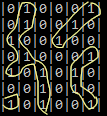

# DL.IQ.IslandFinder
Interview Question: Given a 2-dimension map, find the number of islands 
formed by a group of connected 1s. 

For example, if the input map looks like this:

The program should return **4**.